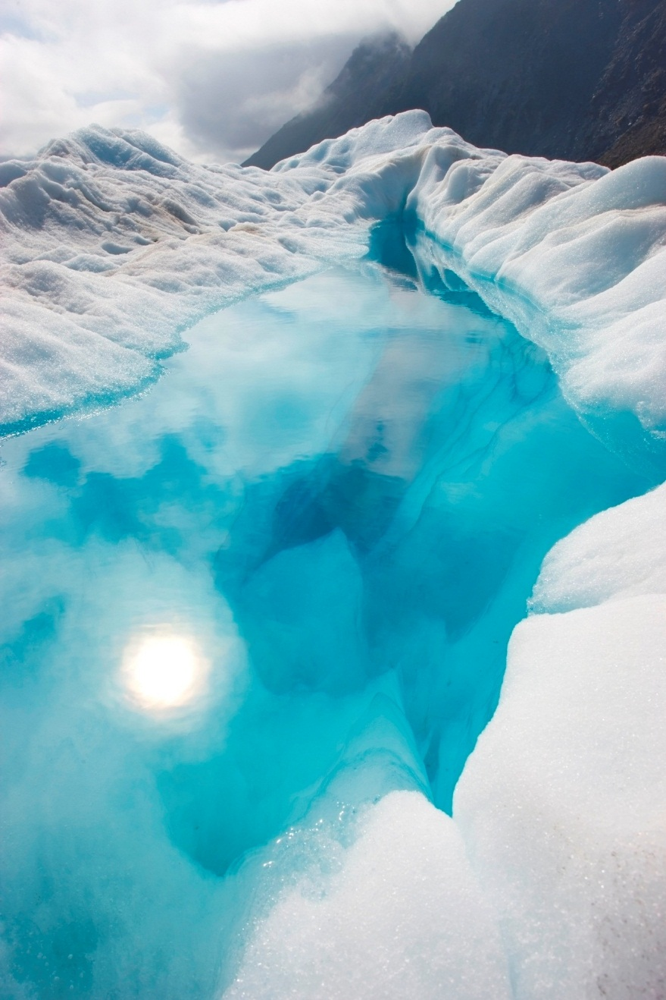

报告标题

报告标题

姓名 | 课程名称 | 日期

标题 1
====

若要替换此页中的占位符文本，选中该文本并开始输入即可。但请暂时不要这样做！

首先请查看可帮助快速设置报告格式的提示。你可能会为其简单感到惊讶。

*   需要标题？在“开始”选项卡上的样式库中，单击所需标题样式即可。
*   请注意样式库中的其他样式，例如报价单、编号列表，或者类似本列表的项目符号列表。
*   为在选择要复制或编辑的文本时达到最佳效果，请勿在所选字符左右包含空格。

标题 2
----

你可能像我们一样喜欢封面上的照片，但如果它不适合你的报告，可轻松将其替换为自己的图片。

删除占位图片，然后在“插入”选项卡上，单击“图片”以从文件选择图片即可。